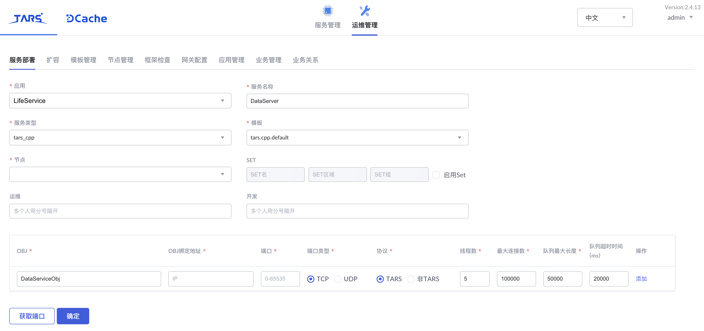

# DataServer

LifeService 小程序案例数据访问后端，用于直接操作数据库，对其他服务提供数据操作接口。

服务接口可查看 [接口文档](docs/RPC.md)

## 项目结构
```sh
.
├── CMakeLists.txt
├── README.md
├── build
├── conf
│   └── DataServer.conf     # 配置文件
├── docs
│   ├── RPC.md
│   └── images
├── src
│   ├── CMakeLists.txt
│   ├── Config.h            # 配置类
│   ├── DataServer.cpp      # 服务实现
│   ├── DataServer.h
│   ├── DataService.tars    # tars协议文件
│   ├── DataServiceImp.cpp  # 服务接口实现
│   ├── DataServiceImp.h    # 服务接口定义
│   ├── DbHandle.cpp        # DbHandle实现
│   ├── DbHandle.h          # 数据模型
│   ├── MysqlHandler.cpp    # MysqlHandler实现
│   ├── MysqlHandler.h      # Mysql操作
│   ├── util.cpp            # util实现
│   └── util.h              # Mysql join 语句组装工具
└── test
    └── test_util.cpp       # 工具类测试              
```

## 开发环境
* `gcc` >= `4.8.2`
* `bison` >= `2.5`
* `flex` >= `2.5`
* `cmake` >= `3.2.0`
* `mysql` >= `5.6`
* `TarsCpp`开发框架，安装方法参考[TarsCpp 开发环境部署](https://tarscloud.github.io/TarsDocs/env/tarscpp.html)，开发框架的使用可以参考[快速开始](https://tarscloud.github.io/TarsDocs/hello-world/tarscpp.html)和[开发指南](https://tarscloud.github.io/TarsDocs/dev/tarscpp/tars-guide.html)

## 构建方式
将项目 clone 到任意目录下，修改 `Config.h` 中的数据库配置为自己的数据库配置，然后使用下列命令即可编译项目，生成发布包

```sh
git clone https://github.com/TarsDemo/Tars-MiniProgramm-Service-DataServer.git DataServer
cd DataServer
mkdir build
cd build
cmake
make
make tar
```

## 服务部署

### 部署信息

在 TarsWeb `平台->运维管理->服务部署` 中，按如下信息部署服务，其中节点填写自己需要部署服务的节点

* 服务基本信息：
    * 应用名称：`LifeService`
    * 服务名称：`DataServer`
    * 服务类型：`tars_cpp`
    * 模板名称：`tars.cpp.default`
* Obj部署信息：
    * OBJ名称：`DataServiceObj`
    * 协议类型：TARS
    * 端口：自动生成



### 服务发布
在 `TarsWeb 平台->服务管理->LifeService->DataServer->发布管理` 中，

* 选中刚刚部署的节点，点击 `发布选中节点`
* 上传发布包，选中构建项目生成的发布包上传
* 在发布版本中便可以找到刚刚上传的发布包并选择
* 点击 `发布` 即可完成发布

同时需要在 **服务配置** 中添加文件`DataServer.conf`，其中配置如下，没有添加会直接使用`Config.h`中填写的值

```xml
<LifeService>
    usPortConfig=3306
    strDbHostConfig=xxx.xxx.xxx.xxx
    strUserNameConfig=yourusername
    strPassWordConfig=yourpassword
    strDbNameConfig=yourdbname
    maxMatch=2000
</LifeService>
```
