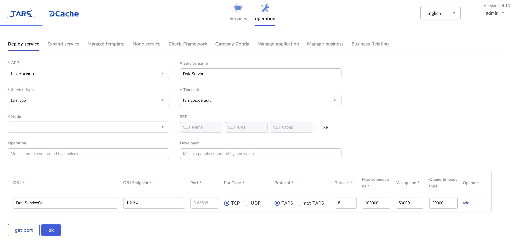

# DataServer

[中文版](README.md)

DataServer is the data access backend of miniprogram LifeService. It directly connects to the MySQL server and provides data operation interface to other services.

For server interface, see [API Document](docs/RPC.md).

## Structure

```sh
.
├── CMakeLists.txt
├── README.md
├── build
├── conf
│   └── DataServer.conf     # 配置文件
├── docs
│   ├── RPC.md
│   └── images
├── src
│   ├── CMakeLists.txt
│   ├── Config.h            # 配置类
│   ├── DataServer.cpp      # 服务实现
│   ├── DataServer.h
│   ├── DataService.tars    # tars协议文件
│   ├── DataServiceImp.cpp  # 服务接口实现
│   ├── DataServiceImp.h    # 服务接口定义
│   ├── DbHandle.cpp        # DbHandle实现
│   ├── DbHandle.h          # 数据模型
│   ├── MysqlHandler.cpp    # MysqlHandler实现
│   ├── MysqlHandler.h      # Mysql操作
│   ├── util.cpp            # util实现
│   └── util.h              # Mysql join 语句组装工具
└── test
    └── test_util.cpp       # 工具类测试              
```

## Development Environment

* `gcc` >= `4.8.2`
* `bison` >= `2.5`
* `flex` >= `2.5`
* `cmake` >= `3.2.0`
* `mysql` >= `5.6`
* `TarsCpp` Development Framework，see [TarsCpp Development Environment Setup](https://tarscloud.github.io/TarsDocs/env/tarscpp.html) for installation，[Quick Start](https://tarscloud.github.io/TarsDocs/hello-world/tarscpp.html) and [Development Guide](https://tarscloud.github.io/TarsDocs/dev/tarscpp/tars-guide.html) for development.

## Build

Clone this project and configure MySQL information in `Config.h`，then compile and generate publish package by the following command.

```sh
git clone https://github.com/TarsDemo/Tars-MiniProgramm-Service-DataServer.git DataServer
cd DataServer
mkdir build
cd build
cmake
make
make tar
```

## Server Deployment

### Deployment Configuration

Go to `TarsWeb->Operation->Deploy service`, and deploy the service according to the following configuration.

* Service info：
    * APP: `LifeService`
    * Service name: `DataServer`
    * Service type: `tars_cpp`
    * Template: `tars.cpp.default`
    * Node: The node that you want to deploy the service.
* Obj info:
    * OBJ: `DataServiceObj`
    * Protocol: TARS
    * Port: Auto-gen



### Publish Service

Go to `TarsWeb->Services->LifeService->DataServer->Publish`, and

* Choose the node which you just deploy and click `publish node`.
* click `upload release package` and choose the package you just built to upload.
* Select the version you just uploaded in the `release version` list.
* Click `publish` and finish.

Besides, we need to add `DataServer.conf` in the `Service Configuration`. If not, the service will load the default configuration in `Config.h`. The content of the configuration file is as follows.

```xml
<LifeService>
    usPortConfig=3306
    strDbHostConfig=xxx.xxx.xxx.xxx
    strUserNameConfig=yourusername
    strPassWordConfig=yourpassword
    strDbNameConfig=yourdbname
    maxMatch=2000
</LifeService>
```
